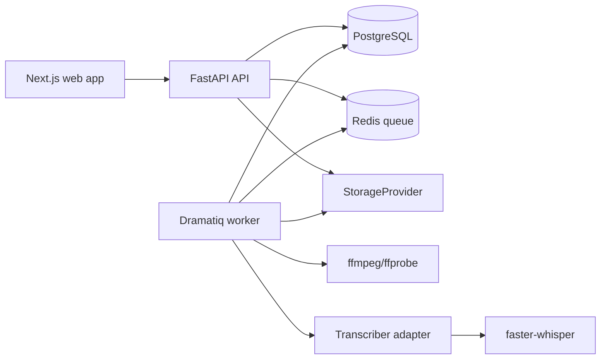
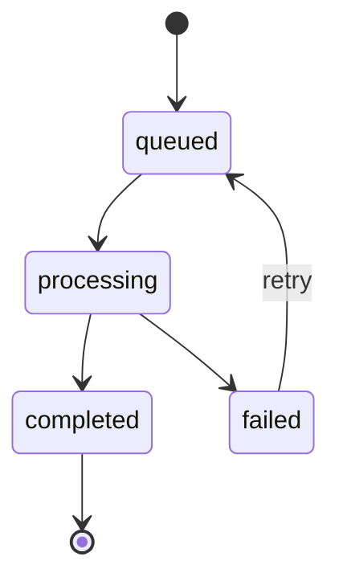

# Architecture

ClipForge is a monorepo content engine for user-provided video sources (local upload or YouTube URL). Phase 1 builds ingestion, storage, background jobs, audio extraction, transcription, and a transcript review UI. The app does not validate source rights; see `docs/DECISIONS.md` ("Remove Source Rights Gate; Allow YouTube Download") for why, and the risk the user accepts by providing a YouTube URL.

## Repository Structure

```text
apps/
  web/                 Next.js, TypeScript, Tailwind UI
  api/                 FastAPI HTTP API
workers/              Dramatiq workers and media pipeline stages
packages/
  shared-types/        Generated API/domain types used by web and api
docs/                 Architecture, roadmap, decisions, platform rules
tests/
  fixtures/            Small speech MP4 and generated test assets
docker-compose.yml    Web, API, worker, PostgreSQL, Redis
```

## Component Diagram



## Phase 1 Data Model

### projects

- `id`: UUID primary key
- `name`: text
- `created_at`: timestamp
- `updated_at`: timestamp

### source_videos

- `id`: UUID primary key
- `project_id`: foreign key to `projects`
- `title`: text
- `source_kind`: enum: `local_upload`, `youtube_url`
- `source_reference`: nullable text — the original YouTube URL for `youtube_url` sources, null for uploads
- `duration_ms`: nullable integer
- `width`: nullable integer
- `height`: nullable integer
- `frame_rate`: nullable text
- `status`: enum: `draft`, `uploaded`, `downloading`, `processing`, `ready`, `failed`
- `created_at`: timestamp
- `updated_at`: timestamp

No rights fields. The app does not track or validate source rights — see `docs/DECISIONS.md`.

### media_assets

- `id`: UUID primary key
- `source_video_id`: foreign key to `source_videos`
- `asset_kind`: enum: `original_video`, `extracted_audio`, `thumbnail`, `analysis_artifact`
- `storage_key`: text, generated by the app
- `mime_type`: text
- `byte_size`: integer
- `checksum_sha256`: text
- `metadata_json`: JSON
- `created_at`: timestamp

### jobs

- `id`: UUID primary key
- `source_video_id`: nullable foreign key to `source_videos`
- `stage`: enum: `test_stage`, `youtube_download`, `upload_metadata`, `audio_extract`, `transcribe`, `signal_extraction`
- `state`: enum: `queued`, `processing`, `completed`, `failed`
- `progress`: integer 0-100
- `attempts`: integer
- `error_code`: nullable text
- `error_message`: nullable text
- `input_json`: JSON
- `output_json`: JSON
- `created_at`: timestamp
- `started_at`: nullable timestamp
- `completed_at`: nullable timestamp

`test_stage` is not a domain concept — it exists only so the generic stage-runner and retry mechanism can be exercised deterministically (fails a configurable number of attempts, then succeeds), without depending on real media processing.

### transcripts

- `id`: UUID primary key
- `source_video_id`: foreign key to `source_videos`
- `transcriber_name`: text
- `transcriber_model`: text
- `language`: nullable text
- `duration_ms`: integer
- `created_at`: timestamp

### transcript_segments

- `id`: UUID primary key
- `transcript_id`: foreign key to `transcripts`
- `start_ms`: integer
- `end_ms`: integer
- `text`: text
- `speaker_label`: nullable text
- `confidence`: nullable float

### transcript_words

- `id`: UUID primary key
- `segment_id`: foreign key to `transcript_segments`
- `start_ms`: integer
- `end_ms`: integer
- `word`: text
- `confidence`: nullable float
- `word_index`: integer

### signals

- `id`: UUID primary key
- `source_video_id`: foreign key to `source_videos`
- `signal_type`: enum: `loudness_rms`, `scene_change`, `pause`, `speech_rate`
- `unit`: text (`dbfs`, `event`, `ms`, `wpm`)
- `points_json`: JSON — a list of `{t_ms, ...}` points; shape depends on `signal_type` (see `app/models/signal.py`)
- `created_at`: timestamp

One row per `(source_video_id, signal_type)` — a whole time series per row, not one row per sample point. Re-running extraction deletes and replaces the four rows for that source, same idempotency pattern as `transcripts`.

## Job State Machine



Rules:

- Every stage is idempotent.
- A stage writes durable output before enqueueing the next stage.
- Retry creates a new attempt on the same job record.
- The API returns before media stages start.
- Progress is best-effort and must be monotonic per attempt.

## Provider Interfaces

### StorageProvider

- `put_bytes(asset_id, stream, metadata) -> StoredObject`
- `open_read(storage_key) -> BinaryIO`
- `exists(storage_key) -> bool`
- `delete(storage_key) -> None`

Phase 1 adapter: local disk. API responses never expose filesystem paths.

### Transcriber

- `transcribe(audio_path) -> TranscriptResult`

Phase 1 adapter: `FasterWhisperTranscriber`, word timestamps always on. Uses `large-v3` on CUDA when available (`WHISPER_MODEL_CUDA`) and a smaller CPU model otherwise (`WHISPER_MODEL_CPU`, default `tiny`); `WHISPER_DEVICE` overrides autodetection. See `docs/DECISIONS.md` for why the CPU default is `tiny` rather than a more accurate model, and what that means for timestamp precision.

### LLMProvider

- `generate(prompt: str) -> (text, LLMUsage)` — one raw call, returning usage/cost alongside the text.
- `generate_structured(provider, prompt, schema, max_retries)` — provider-agnostic: parses/validates the response as JSON against a Pydantic schema, retrying with a correction message on invalid output, up to `max_retries` times. Never raises itself; returns a `StructuredCallResult` with `.success`.
- `run_llm_call(db, provider, prompt_name, prompt_version, prompt, schema, source_video_id=None)` — DB-aware wrapper: calls `generate_structured`, records one `AIAnalysis` row regardless of outcome (a failed call still cost tokens), then raises `LLMStructuredOutputError` on failure.

T08 adapter: `GeminiProvider` (Gemini API over plain HTTP via `requests`, no SDK dependency), selected by `LLM_PROVIDER=gemini` (the only implemented value so far; `get_llm_provider()` is where a future `openai` branch goes). Model via `GEMINI_MODEL` (default `gemini-3.6-flash`), key via `GEMINI_API_KEY`. Extended "thinking" is disabled per call (`thinkingConfig.thinkingBudget: 0`) — cheaper and faster for structured-output tasks that don't need deep reasoning; a trivial prompt cost 52 thought tokens with the default budget and 0 with it disabled. Per-token pricing is a placeholder (see `docs/DECISIONS.md`) pending verification against current Google AI pricing.

Prompts are files, not inline strings: `app/services/prompts.py` loads `app/prompts/{name}/v{version}.txt`, so a prompt change is a diffable, reviewable change with its own version number recorded on every `AIAnalysis` row it produces. T08 ships one demo prompt (`structured_demo/v1`) that exists only to exercise this infrastructure end-to-end; real clip-scoring prompts are T09's job ("Out of scope: Clip logic" in TASKS.md's T08 entry).

### ai_analyses

- `id`: UUID primary key
- `source_video_id`: nullable foreign key to `source_videos` (null until a call is tied to a specific source, e.g. clip scoring in T09)
- `provider`: text (`gemini`)
- `model`: text
- `prompt_name`: text
- `prompt_version`: integer
- `attempts`: integer
- `input_tokens`, `output_tokens`: integer
- `cost_usd`: float
- `success`: boolean
- `error_message`: nullable text
- `raw_response`: nullable text (truncated to 5000 chars)
- `created_at`: timestamp

One row per LLM call attempt sequence (all retries counted as one row, `attempts` records how many), successful or not.

### SourceProvider

Phase 1 supports two source kinds: local uploads and YouTube URLs.

- `LocalUploadSourceProvider`: accepts an uploaded file directly.
- `YouTubeSourceProvider`: downloads the video behind a YouTube URL (e.g. via `yt-dlp`) into a `MediaAsset`, driven by the `youtube_download` job stage. This runs against YouTube's Terms of Service (see `docs/DECISIONS.md`); the app does not validate or claim any right to the content, and the user is responsible for the source.

## Phase 1 API Endpoints

### Health

- `GET /health`
- Returns API version and dependency health.

### Projects

- `POST /projects`
- `GET /projects`
- `GET /projects/{project_id}`

### Source Videos

- `POST /projects/{project_id}/sources`
- Creates a source video record, either `source_kind: local_upload` (awaiting a follow-up upload) or `source_kind: youtube_url` (with a `source_reference` URL, which enqueues the `youtube_download` stage immediately).
- `GET /projects/{project_id}/sources`
- `GET /projects/{project_id}/sources/{source_video_id}`
- `GET /projects/{project_id}/sources/{source_video_id}/assets`
- `GET /projects/{project_id}/sources/{source_video_id}/assets/{asset_id}/content`
- Streams the stored asset bytes (e.g. for the video player) by its generated asset ID. Never exposes the underlying filesystem path.

### Uploads

- `POST /projects/{project_id}/sources/{source_video_id}/upload`
- Accepts MP4 fixture and later configured formats.
- Validates format and size only. No rights fields are collected or checked.
- Stores an original `MediaAsset` with a generated asset ID.
- Enqueues the `upload_metadata` job stage (ffprobe).
- Returns immediately, before the job runs.

### Transcription

- `POST /projects/{project_id}/sources/{source_video_id}/transcribe`
- Enqueues `audio_extract`, which auto-chains into `transcribe` on success (see "Job Chaining" below). Allowed once the source is `uploaded`, `ready` (re-transcribe) or `failed` (retry); not while a source is still `draft`, `downloading` or `processing`.
- Returns immediately, before either job runs.
- `GET /sources/{source_video_id}/transcript`
- Returns the latest transcript's segments and words with timestamps. 404 if none exists yet.

### Signal Extraction

- `POST /projects/{project_id}/sources/{source_video_id}/extract-signals`
- Enqueues `signal_extraction` (loudness/RMS, scene changes via PySceneDetect, pauses and speech rate from the stored transcript). Requires the source to already be `ready` (i.e. a transcript exists). Does *not* auto-chain from `transcribe` — see "Job chaining" below.
- Returns immediately, before the job runs.
- `GET /projects/{project_id}/sources/{source_video_id}/signals`
- Returns the four `Signal` time series (empty list if extraction hasn't run yet).

### Jobs

- `GET /jobs/{job_id}`
- `GET /projects/{project_id}/jobs`
- `POST /jobs/{job_id}/retry`

#### Job chaining

Most stages are triggered explicitly (upload → `upload_metadata`, a YouTube URL → `youtube_download`, the transcribe endpoint → `audio_extract`, the extract-signals endpoint → `signal_extraction`). One pair auto-chains: `audio_extract` enqueues `transcribe` itself on success, because they're really one user-facing action ("transcribe this video") split into two idempotent, separately-retryable stages. Upload/download do *not* auto-chain into `audio_extract`, and `transcribe` does not auto-chain into `signal_extraction` — each is compute-heavy, so it only runs when explicitly requested (see `docs/DECISIONS.md`).

## Phase 1 UI Pages

### Home / Project List

- Shows projects and creates a project.

### Project Detail

- Add-source form: upload a local file, or paste a YouTube URL.
- Source list with processing state.

### Source Detail

- Video player.
- Metadata (source kind, original YouTube URL if applicable).
- Job status polling (stage, state, error) with a retry action on failed jobs.
- Transcript panel with clickable timestamps that seek the player.
- Signals timeline: loudness, speech rate, scene changes, and pauses over time (small multiples sharing a time axis), with an "Extract signals" trigger once the source is `ready`. TASKS.md names the "project page" for this; it lives on Source Detail instead because a signal series is per-source, and this page already has the player/transcript it's most useful alongside — see `docs/DECISIONS.md`.

## Candidate Windows (Phase 2)

`app/services/clip_presets.py` mirrors the "Clip length presets" table in `AGENTS.md` (`shorts_campaign`, `shorts_long`, `tiktok_rewards`, `longform` — min/max duration and aspect ratio). `app/services/candidate_windows.py` generates every window, per preset, whose start and end land exactly on a transcript sentence (segment) boundary and whose duration fits the preset's bounds; overlapping windows from different start sentences are kept, not deduplicated.

## Candidate Scoring (Phase 2)

`POST /projects/{project_id}/sources/{source_video_id}/score-candidates` (body: `{"prompt_version": int, default 1}`), requires the source to be `ready` with at least one `Signal` row extracted. Enqueues `candidate_scoring`, returns immediately. `GET /projects/{project_id}/sources/{source_video_id}/candidates` lists results, ranked by `combined_score` descending.

Per preset, the `candidate_scoring` stage:

1. Generates candidate windows (`app/services/candidate_windows.py`).
2. Scores each by cheap heuristics only — `app/services/candidate_scoring.py`'s `compute_heuristic_features`/`heuristic_score`, from the T06 `Signal` series (avg loudness, pause ratio, avg speech rate, scene-change count within the window). No LLM call yet.
3. Deduplicates via non-maximum suppression on those heuristic scores (`deduplicate_windows`): keeps the highest-scoring window, drops any remaining window overlapping it by more than `iou_threshold` (default 0.5), repeats, capped at `_MAX_CANDIDATES_PER_PRESET` (3). This bounds how many (paid, slow) LLM calls one scoring run makes.
4. Only the survivors get an LLM call — `app/services/llm_provider.py`'s `run_llm_call`, prompt `clip_scoring/v{version}`, schema `ClipCandidateScore` (`hook_line`, `self_contained`, `emotional_peak`, `quotable_line`, `score` 0-100, `reason`). A candidate whose LLM call fails (even after T08's retry) is skipped, not fatal to the whole stage — partial results beat none; the stage itself only fails if *every* call failed.
5. `combined_score = 0.3 * heuristic_score + 0.7 * llm_score` (tunable, undocumented-as-final — see `docs/DECISIONS.md`), persisted as a `ClipCandidate` row alongside the full feature vector, model, prompt name, and prompt version.

### clip_candidates

- `id`: UUID primary key
- `source_video_id`: foreign key to `source_videos`
- `preset`: text
- `start_ms`, `end_ms`: integer
- `heuristic_score`, `llm_score`, `combined_score`: float
- `hook_line`, `self_contained`, `emotional_peak`: boolean
- `quotable_line`: nullable text
- `reason`: text
- `transcript_excerpt`: text (the exact text sent to the LLM for this window)
- `feature_vector`: JSON (the heuristic sub-features used)
- `model`, `prompt_name`: text
- `prompt_version`: integer
- `review_status`: enum: `pending`, `accepted`, `rejected` (T10)
- `created_at`: timestamp

## Candidate Review (Phase 2, T10)

- `PATCH /projects/{project_id}/sources/{source_video_id}/candidates/{candidate_id}`
- Body: any of `start_ms`+`end_ms` (both together), `review_status`. Adjusted times must each land exactly on a transcript sentence boundary (same rule T07's window generation itself follows) and the resulting duration must still fit the candidate's preset — both checked against the live transcript/`CLIP_PRESETS`, not just accepted as given. Returns the updated `ClipCandidateRead`.
- `GET /projects/{project_id}/sources/{source_video_id}/candidates/{candidate_id}/thumbnail`
- Grabs a single JPEG frame from the original video at the candidate's current `start_ms` via ffmpeg (`app/services/ffmpeg.py`'s `extract_thumbnail_jpeg`), generated on demand, not persisted — reflects whatever `start_ms` is currently saved, including after a time adjustment.

### Source Detail UI

Adds a Candidates panel (below Signals): a "Score candidates" / "Re-score candidates" trigger, then one card per `ClipCandidate` (ranked, matching the API order) with its thumbnail, preset, review status, combined score, transcript excerpt, reason, and quotable line. Each card has a Preview button (seeks the shared video player — `lib/video-player.ts`'s `seekVideoPlayer`, also now used by the Transcript panel — to the candidate's current `start_ms`), start/end `<select>` dropdowns populated only with real transcript sentence boundaries (so the UI cannot submit an invalid, non-snapped time — the same guarantee the server enforces, just also enforced client-side by construction), and Accept/Reject buttons.

Re-scoring the same `(source_video, preset, prompt_name, prompt_version)` replaces those rows (idempotent retry). Scoring under a *new* `prompt_version` adds alongside old rows rather than replacing them — old results survive a prompt change, which is what lets the learning loop (`AGENTS.md`) eventually compare prompt versions against each other. See `docs/DECISIONS.md`.

## Local Development Setup

Phase 1 local development target:

```powershell
docker compose up
```

Expected services:

- `web`: Next.js dev server.
- `api`: FastAPI with `/health`.
- `worker`: Dramatiq worker.
- `postgres`: PostgreSQL database.
- `redis`: queue broker.

Development commands should be added in T02:

```powershell
docker compose run --rm api pytest
docker compose run --rm web npm test
docker compose run --rm api alembic upgrade head
```

### Worker and API code sharing

The `worker` container mounts `apps/api` read-only and adds it to `PYTHONPATH`, so job stage handlers (`app.services.jobs`, `app.models.*`) run identically whether invoked directly (e.g. in API tests) or via the `run_job_stage` Dramatiq actor in `workers/clip_engine_worker/jobs.py`. The API process only ever enqueues (`run_job_stage.send(...)`); it never runs a stage handler itself outside of tests. Alembic migrations live solely under `apps/api` — the worker never runs migrations, only reads/writes rows in tables the API has already migrated. Both `api` and `worker` share the `storage_data` volume so stage handlers (e.g. ffprobe on an uploaded file) can read what the API wrote.

## Phase Boundaries

Phase 1 stops after transcription and transcript review. Candidate scoring, LLM calls, rendering, reaction pairing, publishing, and analytics are later phases and should not be implemented before their tasks.
