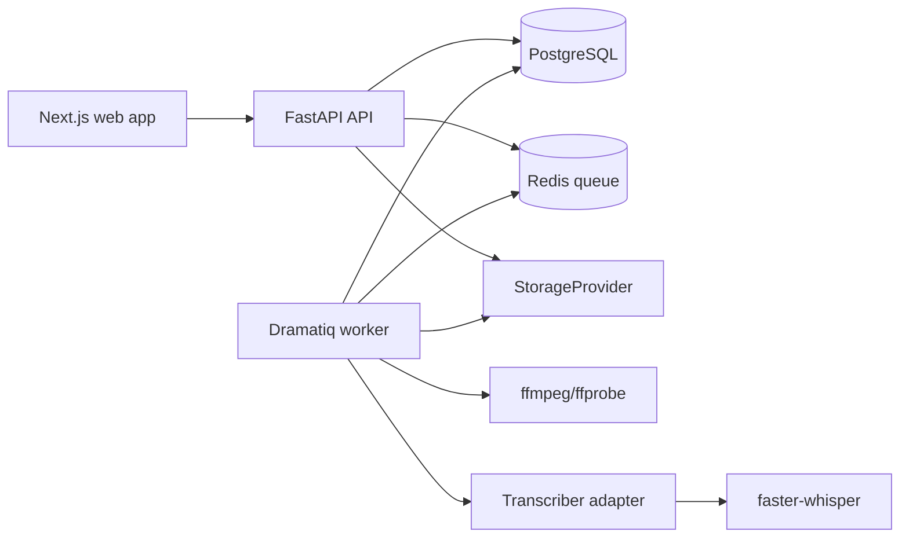
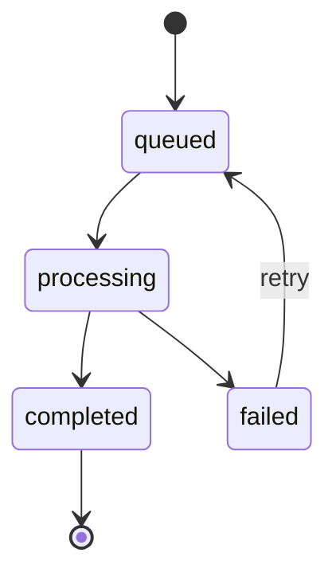

# Architecture

ClipForge is a monorepo content engine for user-provided video sources (local upload or YouTube URL). Phase 1 builds ingestion, storage, background jobs, audio extraction, transcription, and a transcript review UI. The app does not validate source rights; see `docs/DECISIONS.md` ("Remove Source Rights Gate; Allow YouTube Download") for why, and the risk the user accepts by providing a YouTube URL.

## Repository Structure

```text
apps/
  web/                 Next.js, TypeScript, Tailwind UI
  api/                 FastAPI HTTP API
workers/              Dramatiq workers and media pipeline stages
packages/
  shared-types/        Generated API/domain types used by web and api
docs/                 Architecture, roadmap, decisions, platform rules
tests/
  fixtures/            Small speech MP4 and generated test assets
docker-compose.yml    Web, API, worker, PostgreSQL, Redis
```

## Component Diagram



## Phase 1 Data Model

### projects

- `id`: UUID primary key
- `name`: text
- `created_at`: timestamp
- `updated_at`: timestamp

### source_videos

- `id`: UUID primary key
- `project_id`: foreign key to `projects`
- `title`: text
- `source_kind`: enum: `local_upload`, `youtube_url`
- `source_reference`: nullable text — the original YouTube URL for `youtube_url` sources, null for uploads
- `duration_ms`: nullable integer
- `width`: nullable integer
- `height`: nullable integer
- `frame_rate`: nullable text
- `status`: enum: `draft`, `uploaded`, `downloading`, `processing`, `ready`, `failed`
- `created_at`: timestamp
- `updated_at`: timestamp

No rights fields. The app does not track or validate source rights — see `docs/DECISIONS.md`.

### media_assets

- `id`: UUID primary key
- `source_video_id`: foreign key to `source_videos`
- `asset_kind`: enum: `original_video`, `extracted_audio`, `thumbnail`, `analysis_artifact`
- `storage_key`: text, generated by the app
- `mime_type`: text
- `byte_size`: integer
- `checksum_sha256`: text
- `metadata_json`: JSON
- `created_at`: timestamp

### jobs

- `id`: UUID primary key
- `source_video_id`: nullable foreign key to `source_videos`
- `stage`: enum: `test_stage`, `youtube_download`, `upload_metadata`, `audio_extract`, `transcribe`
- `state`: enum: `queued`, `processing`, `completed`, `failed`
- `progress`: integer 0-100
- `attempts`: integer
- `error_code`: nullable text
- `error_message`: nullable text
- `input_json`: JSON
- `output_json`: JSON
- `created_at`: timestamp
- `started_at`: nullable timestamp
- `completed_at`: nullable timestamp

`test_stage` is not a domain concept — it exists only so the generic stage-runner and retry mechanism can be exercised deterministically (fails a configurable number of attempts, then succeeds), without depending on real media processing.

### transcripts

- `id`: UUID primary key
- `source_video_id`: foreign key to `source_videos`
- `transcriber_name`: text
- `transcriber_model`: text
- `language`: nullable text
- `duration_ms`: integer
- `created_at`: timestamp

### transcript_segments

- `id`: UUID primary key
- `transcript_id`: foreign key to `transcripts`
- `start_ms`: integer
- `end_ms`: integer
- `text`: text
- `speaker_label`: nullable text
- `confidence`: nullable float

### transcript_words

- `id`: UUID primary key
- `segment_id`: foreign key to `transcript_segments`
- `start_ms`: integer
- `end_ms`: integer
- `word`: text
- `confidence`: nullable float
- `word_index`: integer

## Job State Machine



Rules:

- Every stage is idempotent.
- A stage writes durable output before enqueueing the next stage.
- Retry creates a new attempt on the same job record.
- The API returns before media stages start.
- Progress is best-effort and must be monotonic per attempt.

## Provider Interfaces

### StorageProvider

- `put_bytes(asset_id, stream, metadata) -> StoredObject`
- `open_read(storage_key) -> BinaryIO`
- `exists(storage_key) -> bool`
- `delete(storage_key) -> None`

Phase 1 adapter: local disk. API responses never expose filesystem paths.

### Transcriber

- `transcribe(audio_path) -> TranscriptResult`

Phase 1 adapter: `FasterWhisperTranscriber`, word timestamps always on. Uses `large-v3` on CUDA when available (`WHISPER_MODEL_CUDA`) and a smaller CPU model otherwise (`WHISPER_MODEL_CPU`, default `tiny`); `WHISPER_DEVICE` overrides autodetection. See `docs/DECISIONS.md` for why the CPU default is `tiny` rather than a more accurate model, and what that means for timestamp precision.

### LLMProvider

Defined but unused in Phase 1. Candidate scoring starts in Phase 2.

### SourceProvider

Phase 1 supports two source kinds: local uploads and YouTube URLs.

- `LocalUploadSourceProvider`: accepts an uploaded file directly.
- `YouTubeSourceProvider`: downloads the video behind a YouTube URL (e.g. via `yt-dlp`) into a `MediaAsset`, driven by the `youtube_download` job stage. This runs against YouTube's Terms of Service (see `docs/DECISIONS.md`); the app does not validate or claim any right to the content, and the user is responsible for the source.

## Phase 1 API Endpoints

### Health

- `GET /health`
- Returns API version and dependency health.

### Projects

- `POST /projects`
- `GET /projects`
- `GET /projects/{project_id}`

### Source Videos

- `POST /projects/{project_id}/sources`
- Creates a source video record, either `source_kind: local_upload` (awaiting a follow-up upload) or `source_kind: youtube_url` (with a `source_reference` URL, which enqueues the `youtube_download` stage immediately).
- `GET /projects/{project_id}/sources`
- `GET /projects/{project_id}/sources/{source_video_id}`
- `GET /projects/{project_id}/sources/{source_video_id}/assets`
- `GET /projects/{project_id}/sources/{source_video_id}/assets/{asset_id}/content`
- Streams the stored asset bytes (e.g. for the video player) by its generated asset ID. Never exposes the underlying filesystem path.

### Uploads

- `POST /projects/{project_id}/sources/{source_video_id}/upload`
- Accepts MP4 fixture and later configured formats.
- Validates format and size only. No rights fields are collected or checked.
- Stores an original `MediaAsset` with a generated asset ID.
- Enqueues the `upload_metadata` job stage (ffprobe).
- Returns immediately, before the job runs.

### Transcription

- `POST /projects/{project_id}/sources/{source_video_id}/transcribe`
- Enqueues `audio_extract`, which auto-chains into `transcribe` on success (see "Job Chaining" below). Allowed once the source is `uploaded`, `ready` (re-transcribe) or `failed` (retry); not while a source is still `draft`, `downloading` or `processing`.
- Returns immediately, before either job runs.
- `GET /sources/{source_video_id}/transcript`
- Returns the latest transcript's segments and words with timestamps. 404 if none exists yet.

### Jobs

- `GET /jobs/{job_id}`
- `GET /projects/{project_id}/jobs`
- `POST /jobs/{job_id}/retry`

#### Job chaining

Most stages are triggered explicitly (upload → `upload_metadata`, a YouTube URL → `youtube_download`, the transcribe endpoint → `audio_extract`). One pair auto-chains: `audio_extract` enqueues `transcribe` itself on success, because they're really one user-facing action ("transcribe this video") split into two idempotent, separately-retryable stages. Upload/download do *not* auto-chain into `audio_extract` — transcription is compute-heavy, so it only runs when explicitly requested, not on every upload (see `docs/DECISIONS.md`).

## Phase 1 UI Pages

### Home / Project List

- Shows projects and creates a project.

### Project Detail

- Add-source form: upload a local file, or paste a YouTube URL.
- Source list with processing state.

### Source Detail

- Video player.
- Metadata (source kind, original YouTube URL if applicable).
- Job status polling (stage, state, error) with a retry action on failed jobs.
- Transcript panel with clickable timestamps that seek the player.

## Local Development Setup

Phase 1 local development target:

```powershell
docker compose up
```

Expected services:

- `web`: Next.js dev server.
- `api`: FastAPI with `/health`.
- `worker`: Dramatiq worker.
- `postgres`: PostgreSQL database.
- `redis`: queue broker.

Development commands should be added in T02:

```powershell
docker compose run --rm api pytest
docker compose run --rm web npm test
docker compose run --rm api alembic upgrade head
```

### Worker and API code sharing

The `worker` container mounts `apps/api` read-only and adds it to `PYTHONPATH`, so job stage handlers (`app.services.jobs`, `app.models.*`) run identically whether invoked directly (e.g. in API tests) or via the `run_job_stage` Dramatiq actor in `workers/clip_engine_worker/jobs.py`. The API process only ever enqueues (`run_job_stage.send(...)`); it never runs a stage handler itself outside of tests. Alembic migrations live solely under `apps/api` — the worker never runs migrations, only reads/writes rows in tables the API has already migrated. Both `api` and `worker` share the `storage_data` volume so stage handlers (e.g. ffprobe on an uploaded file) can read what the API wrote.

## Phase Boundaries

Phase 1 stops after transcription and transcript review. Candidate scoring, LLM calls, rendering, reaction pairing, publishing, and analytics are later phases and should not be implemented before their tasks.
