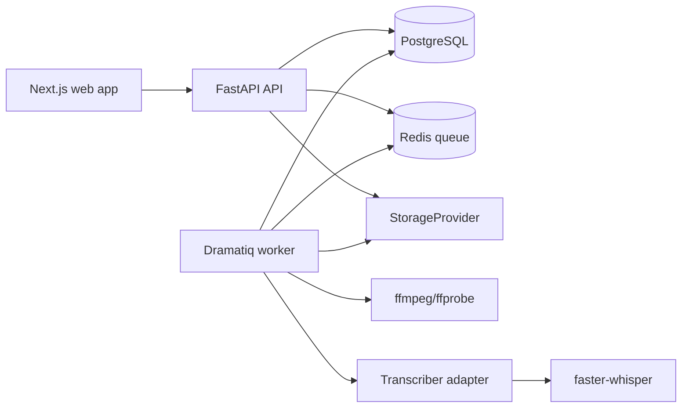
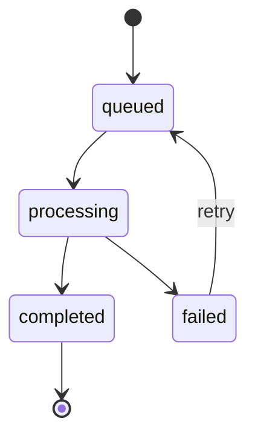

# Architecture

ClipForge is a monorepo content engine for authorized video sources. Phase 1 builds ingestion, rights validation, storage, background jobs, audio extraction, transcription, and a transcript review UI.

## Repository Structure

```text
apps/
  web/                 Next.js, TypeScript, Tailwind UI
  api/                 FastAPI HTTP API
workers/              Dramatiq workers and media pipeline stages
packages/
  shared-types/        Generated API/domain types used by web and api
docs/                 Architecture, roadmap, decisions, platform rules
tests/
  fixtures/            Small speech MP4 and generated test assets
docker-compose.yml    Web, API, worker, PostgreSQL, Redis
```

## Component Diagram



## Phase 1 Data Model

### projects

- `id`: UUID primary key
- `name`: text
- `created_at`: timestamp
- `updated_at`: timestamp

### source_videos

- `id`: UUID primary key
- `project_id`: foreign key to `projects`
- `title`: text
- `source_kind`: enum: `local_upload`, `youtube_reference`
- `source_reference`: nullable text
- `rights_type`: enum: `owned`, `campaign`, `licensed`, `creator_permission`
- `rights_reference`: text
- `duration_ms`: nullable integer
- `width`: nullable integer
- `height`: nullable integer
- `frame_rate`: nullable text
- `status`: enum: `draft`, `uploaded`, `processing`, `ready`, `failed`
- `created_at`: timestamp
- `updated_at`: timestamp

### media_assets

- `id`: UUID primary key
- `source_video_id`: foreign key to `source_videos`
- `asset_kind`: enum: `original_video`, `extracted_audio`, `thumbnail`, `analysis_artifact`
- `storage_key`: text, generated by the app
- `mime_type`: text
- `byte_size`: integer
- `checksum_sha256`: text
- `metadata_json`: JSON
- `created_at`: timestamp

### jobs

- `id`: UUID primary key
- `source_video_id`: nullable foreign key to `source_videos`
- `stage`: enum: `upload_metadata`, `audio_extract`, `transcribe`
- `state`: enum: `queued`, `processing`, `completed`, `failed`
- `progress`: integer 0-100
- `attempts`: integer
- `error_code`: nullable text
- `error_message`: nullable text
- `input_json`: JSON
- `output_json`: JSON
- `created_at`: timestamp
- `started_at`: nullable timestamp
- `completed_at`: nullable timestamp

### transcripts

- `id`: UUID primary key
- `source_video_id`: foreign key to `source_videos`
- `transcriber_name`: text
- `transcriber_model`: text
- `language`: nullable text
- `duration_ms`: integer
- `created_at`: timestamp

### transcript_segments

- `id`: UUID primary key
- `transcript_id`: foreign key to `transcripts`
- `start_ms`: integer
- `end_ms`: integer
- `text`: text
- `speaker_label`: nullable text
- `confidence`: nullable float

### transcript_words

- `id`: UUID primary key
- `segment_id`: foreign key to `transcript_segments`
- `start_ms`: integer
- `end_ms`: integer
- `word`: text
- `confidence`: nullable float
- `word_index`: integer

## Job State Machine



Rules:

- Every stage is idempotent.
- A stage writes durable output before enqueueing the next stage.
- Retry creates a new attempt on the same job record.
- The API returns before media stages start.
- Progress is best-effort and must be monotonic per attempt.

## Provider Interfaces

### StorageProvider

- `put_bytes(asset_id, stream, metadata) -> StoredObject`
- `open_read(storage_key) -> BinaryIO`
- `exists(storage_key) -> bool`
- `delete(storage_key) -> None`

Phase 1 adapter: local disk. API responses never expose filesystem paths.

### Transcriber

- `transcribe(audio_asset, options) -> TranscriptResult`

Phase 1 adapter: faster-whisper with word timestamps enabled. Use large-v3 on CUDA when available and a smaller CPU model otherwise.

### LLMProvider

Defined but unused in Phase 1. Candidate scoring starts in Phase 2.

### SourceProvider

Phase 1 uses local uploads and YouTube references only. YouTube references are metadata/reference records; the system does not download YouTube audiovisual media.

## Phase 1 API Endpoints

### Health

- `GET /health`
- Returns API version and dependency health.

### Projects

- `POST /projects`
- `GET /projects`
- `GET /projects/{project_id}`

### Source Videos

- `POST /projects/{project_id}/sources`
- Creates a source video record. For uploads, requires `rights_type` and `rights_reference`.
- `GET /projects/{project_id}/sources/{source_video_id}`
- `GET /projects/{project_id}/sources/{source_video_id}/assets`

### Uploads

- `POST /projects/{project_id}/sources/{source_video_id}/upload`
- Accepts MP4 fixture and later configured formats.
- Validates format, size, and rights fields.
- Stores an original `MediaAsset` with a generated asset ID.
- Enqueues metadata/audio/transcription stages.

### Jobs

- `GET /jobs/{job_id}`
- `GET /projects/{project_id}/jobs`
- `POST /jobs/{job_id}/retry`

### Transcript

- `GET /sources/{source_video_id}/transcript`
- Returns transcript segments and words with timestamps.

## Phase 1 UI Pages

### Home / Project List

- Shows projects and creates a project.

### Project Detail

- Upload form with rights type and rights reference.
- Source list with processing state.
- Job status polling.

### Source Detail

- Video player.
- Metadata and rights record.
- Transcript panel with clickable timestamps that seek the player.
- Processing errors and retry action.

## Local Development Setup

Phase 1 local development target:

```powershell
docker compose up
```

Expected services:

- `web`: Next.js dev server.
- `api`: FastAPI with `/health`.
- `worker`: Dramatiq worker.
- `postgres`: PostgreSQL database.
- `redis`: queue broker.

Development commands should be added in T02:

```powershell
docker compose run --rm api pytest
docker compose run --rm web npm test
docker compose run --rm api alembic upgrade head
```

## Phase Boundaries

Phase 1 stops after transcription and transcript review. Candidate scoring, LLM calls, rendering, reaction pairing, publishing, and analytics are later phases and should not be implemented before their tasks.
